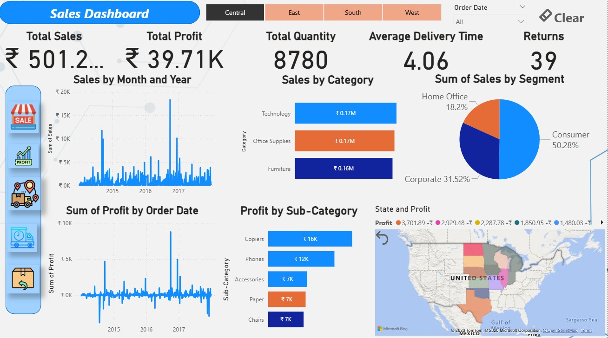

# Sales Dashboard 📊

This project presents an interactive **Sales Analysis Dashboard** built using the Global Superstore dataset.  
The dashboard helps analyze sales performance, profit trends, and regional performance.

---

## 🛠 Tools Used
- Power BI
- Excel
- SQL
- Data Visualization

---

## 📊 Dashboard Features
- Sales by Region
- Profit Analysis
- Category Performance
- Monthly Sales Trends
- Interactive Filters

---

## 📁 Dataset
The dataset used in this project is **Global Superstore Dataset**, commonly used for data analytics practice.

---

## 🚀 Project Objective
The goal of this project is to transform raw sales data into meaningful insights that help businesses make data-driven decisions.

---

## Dashboard Preview

---

## 📈 Key Insights
- West region generated the highest sales.
- Technology category produced the highest profit.
- Some regions showed high sales but low profit margins.

---

## ▶️ How to Use
1. Download the `.pbix` file.
2. Open it using **Power BI Desktop**.
3. Explore the interactive dashboard.

---

## 👨‍💻 Author
**Jeetendra**

Aspiring Data Analyst skilled in Excel, SQL, Power BI, Tableau, and Python.
